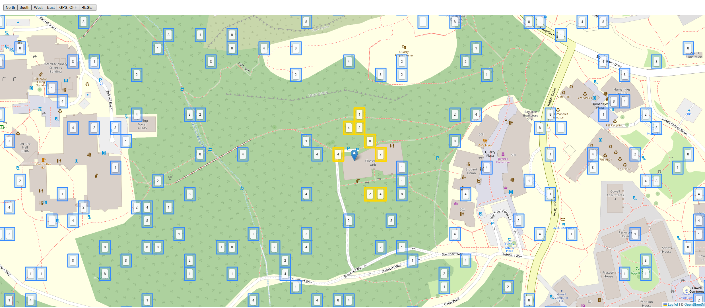

# GeoToken

A location-based token collection and crafting game built on an interactive Leaflet map. Navigate the map around UC Santa Cruz, collect tokens from nearby cells, and craft them together to reach the winning value.

## How It Works

- The map is divided into a grid of cells, some of which contain tokens with values (1, 2, 4, 8).
- **Collect** a token by clicking a nearby highlighted cell.
- **Craft** by clicking a cell whose token matches the one you're holding — the values combine and double.
- Keep crafting until you reach **256** to win!

## Features

- **Interactive map** powered by [Leaflet](https://leafletjs.com/) and OpenStreetMap
- **GPS mode** to play with your real-world location
- **Persistent game state** saved across sessions via localStorage
- **Memento pattern** for efficient cell state tracking
- **Viewport-based rendering** — cells load dynamically as you pan the map

## Built With

- TypeScript
- Leaflet.js
- Vite + Deno

## Play

[**Play on GitHub Pages**](https://camcimahir.github.io/geotoken/)
